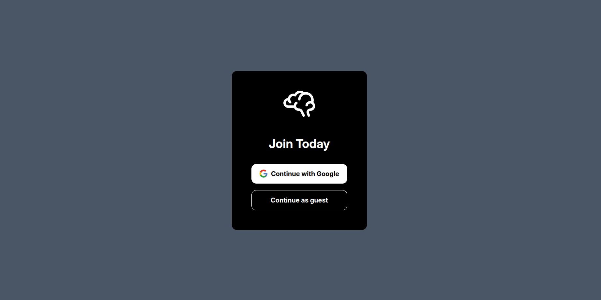
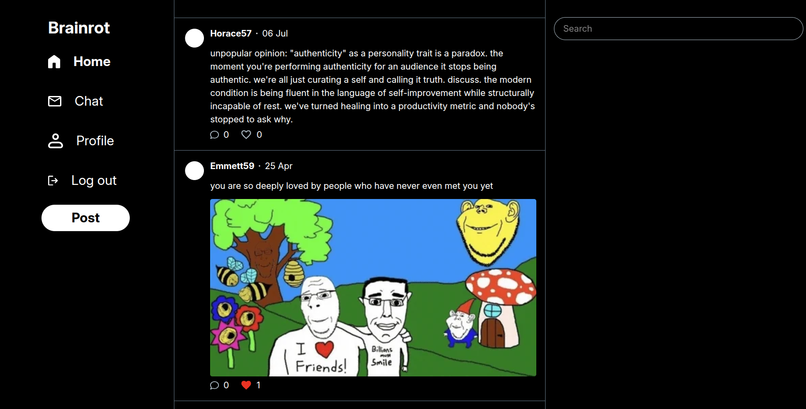

# Social media frontend  

This repo contains the front end code for a social media application inspired by Twitter.

## 📄 Features

### Posting

- Attach images and gifs to posts
- Emoji keyboard support
- Reply to user posts
- Liking enabled for posts and replies

### Profile Customization

- Profile picture and username are set using Google account data after a successful Google authentication  
- Bio customization supported

### Search

- Posts and users that exist on the database can be searched and returned.

### Responsive design

- Mobile, tablet, and desktop viewport support for all application pages

### Chat

- Search function for past conversations is implemented

## 🧰 Languages and tools

[](https://skillicons.dev)

## 📌 To do

- [ ] Socket-based chat for real time updates
- [ ] Instructions for local installation

## 🔗 [Live site](https://brainrotapp.netlify.app/)

## 📷 Demo

<p align="center">
    
</p>
<p align="center">
    
</p>

## Installation instructions

1. Clone project and install dependencies

```bash
git clone git@github.com:lmaqungo/social-media.git
cd social-media
npm install
```

2. Create a .env file in the project root and populate fields with values accordingly

```ini
# localhost server url, 
VITE_DEV_API_URL=http://localhost:3000
#Leave as is, change to 'prod' if you decide to deploy
VITE_ENV=dev
# production server url
VITE_PROD_API_URL=https://your-production-server.com
```

3. Run  

```bash
npm run dev
```


## 🧠 Project Insights

The project could significantly benefit from a refactor. This was my first fullstack application, so many of the crude solutions I came up with were for problems I was encountering for the first time. More specifically, some optimization cosiderations include writing less repetitive and bloated api querying functions, more robust state management(consider using a state management tool like ContextApi), and better file organization of react components. In all honesty, I'm likely NOT  going to refactor it; this project was more of a proof of concept, a learning experience that showed that I was capable of completing a project of this scale on my own. Future applications will incorporate the various optimizations that I've identified. My next steps as a developer will involve exploring modern tools like Nextjs and tanstack query.
